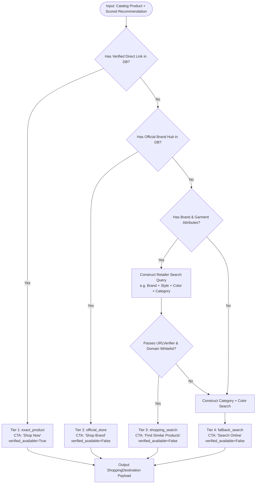

# Universal Shopping Destination Architecture (Phase 8 — Step 12)

## 1. Executive Summary & Objective

The Lumière AI Fashion Search platform indexes 44,442 curated DeepFashion research catalog products powered by Vision Transformer (ViT) classification, CLIP 512-dimensional multimodal embeddings, and sub-millisecond FAISS vector similarity search. 

While the catalog contains high-precision visual embeddings and deep garment metadata (Category, Subcategory, Color, Style, Pattern, Brand), not all research items have direct, live retailer inventory URLs. 

The **Universal Shopping Destination Architecture** solves this gap by ensuring that **every single recommended product** presented to the user has an immediate, legitimate, and safe external shopping destination, while adhering to strict **truthfulness and zero-hallucination guardrails**.

---

## 2. Core Truthfulness & Ethical Commerce Principles

1. **Zero URL Hallucination**:
   - Never generate or guess direct product pages (e.g. `store.com/p/12345` without feed verification).
   - Never fabricate internal product IDs or mock inventory links.
   - Prohibit placeholder domains (`demo-store.example.com`, `example.com`, `test.com`, `localhost`, private subnets).

2. **Accurate Destination Classification**:
   - Never label a search destination as an exact product page.
   - Never claim an item is "In Stock" or "Available Now" unless verified through live verification or authorized retailer feed data.
   - Clearly delineate between *Verified Direct Product Links* and *Curated Attribute Search Destinations*.

3. **HTTPS & Domain Safety**:
   - All generated and resolved URLs strictly enforce HTTPS.
   - All URLs pass through `is_valid_external_url` and `is_private_or_blocked_host` sanitization filters.

---

## 3. Destination Types & Hierarchy

Every recommendation resolves into exactly one primary `ShoppingDestination` based on a deterministic 4-tier priority cascade:

| Priority | Destination Type | Description | CTA Label | Availability Claim |
| :--- | :--- | :--- | :--- | :--- |
| **Tier 1 (Highest)** | `exact_product` | Verified direct retailer product URL (e.g. Myntra / Amazon item page). | **"Shop Now"** | Verified Available / In Stock |
| **Tier 2** | `official_store` | Verified brand storefront or official brand landing hub. | **"Shop Brand"** | Brand Official Hub |
| **Tier 3** | `shopping_search` | Legitimate retailer search query generated from verified product metadata (Brand, Category, Style, Color). | **"Find Similar Products"** | Search Results for Attributes |
| **Tier 4 (Fallback)** | `fallback_search` | Broad query constructed from visual attributes (Category, Color, Pattern) on trusted shopping aggregators. | **"Search Online"** | Broad Shopping Search |

---

## 4. Destination Resolution Algorithm



### Resolution Logic Implementation:
```python
def resolve_shopping_destination(
    product: Product,
    preferred_retailer: Optional[str] = None
) -> ShoppingDestination:
    # 1. Tier 1: Check existing verified direct links
    for link in product.external_links:
        if link.verification_status == "verified" and is_valid_external_url(link.external_url):
            return ShoppingDestination(
                destination_type="exact_product",
                url=link.external_url,
                store_name=link.store_name,
                cta_label="Shop Now",
                is_exact_match=True,
                availability_verified=(link.availability_status == "available"),
                query_terms="",
            )

    # 2. Tier 2: Check official store / brand hub links
    brand_clean = (product.brand or "").strip()
    if product.platform and product.platform.lower() not in {"deepfashion", "catalog", "demo store"}:
        if is_valid_external_url(product.product_url):
            return ShoppingDestination(
                destination_type="official_store",
                url=product.product_url,
                store_name=product.platform,
                cta_label="Shop Brand",
                is_exact_match=False,
                availability_verified=False,
                query_terms=brand_clean,
            )

    # 3. Tier 3: Metadata query construction on trusted retailers
    if brand_clean and brand_clean.lower() != "unknown" and product.category:
        search_query = construct_retailer_query(
            brand=brand_clean,
            category=product.category,
            subcategory=product.subcategory,
            color=product.color,
            style=product.style,
        )
        dest_url, store_name = build_retailer_search_url(search_query, retailer=preferred_retailer or "myntra")
        if dest_url and is_valid_external_url(dest_url):
            return ShoppingDestination(
                destination_type="shopping_search",
                url=dest_url,
                store_name=store_name,
                cta_label="Find Similar Products",
                is_exact_match=False,
                availability_verified=False,
                query_terms=search_query,
            )

    # 4. Tier 4: Fallback generic fashion search
    fallback_query = f"{product.color or ''} {product.category or 'fashion clothing'}".strip()
    fallback_url, fallback_store = build_fallback_search_url(fallback_query)
    return ShoppingDestination(
        destination_type="fallback_search",
        url=fallback_url,
        store_name=fallback_store,
        cta_label="Search Online",
        is_exact_match=False,
        availability_verified=False,
        query_terms=fallback_query,
    )
```

---

## 5. Supported Retailers & Safe Query Construction

### Whitelisted E-Commerce Retailers:
All query endpoints use genuine, public HTTPS search interfaces with strictly encoded parameters:

1. **Myntra (India Fashion Leader)**:
   - Base: `https://www.myntra.com/{slug}` or `https://www.myntra.com/search?rawQuery={query}`
   - Query Encoding: `urllib.parse.quote_plus(query)`

2. **Amazon India Fashion**:
   - Base: `https://www.amazon.in/s?k={query}&i=apparel`
   - Query Encoding: `urllib.parse.quote_plus(query)`

3. **Ajio**:
   - Base: `https://www.ajio.com/search/?text={query}`
   - Query Encoding: `urllib.parse.quote_plus(query)`

4. **Tata CLiQ**:
   - Base: `https://www.tatacliq.com/search/?searchCategory=all&text={query}`
   - Query Encoding: `urllib.parse.quote_plus(query)`

5. **Google Shopping (Global Fallback)**:
   - Base: `https://www.google.com/search?tbm=shop&q={query}`
   - Query Encoding: `urllib.parse.quote_plus(query)`

### Metadata Sanitization Rules:
- Remove noise keywords: "men's", "women's" redundancy, non-alphanumeric punctuation.
- Ensure length is capped between 2 and 6 descriptive terms (e.g. `"Turtle Navy Checked Casual Shirt"`).
- Omit internal database keys, IDs, or model hashes from search terms.

---

## 6. Data Model & Schema Enhancements

### Backend Schemas (`app/schemas/search.py` & `app/schemas/product.py`):

```python
class ShoppingDestination(BaseModel):
    destination_type: str  # "exact_product" | "official_store" | "shopping_search" | "fallback_search"
    url: str               # Guaranteed HTTPS, sanitized external URL
    store_name: str        # e.g., "Myntra", "Amazon", "Ajio", "Official Store"
    cta_label: str         # "Shop Now" | "Shop Brand" | "Find Similar Products" | "Search Online"
    is_exact_match: bool   # True only for verified direct item URLs
    availability_verified: bool # True only if stock status confirmed
    query_terms: Optional[str] = None

class RecommendedProduct(BaseModel):
    product: ProductResponse
    scores: ScoreBreakdown
    # Backward compatibility attributes:
    store_name: Optional[str] = None
    store_url: Optional[str] = None
    store_available: bool = False
    # Universal Destination Object:
    shopping_destination: Optional[ShoppingDestination] = None
```

---

## 7. Frontend User Experience & CTA Behavior

### 1. `ProductCard.tsx` (Recommendation Cards):
- **Card Click**: Navigates to `/product/:id` for full visual attributes, confidence breakdown, and color variants.
- **Action Button on Card**:
  - `exact_product`: Renders `[ Shop Now ↗ ]` (Rose primary gradient).
  - `official_store`: Renders `[ Shop Brand ↗ ]` (Charcoal / Sand styling).
  - `shopping_search`: Renders `[ Find Similar ↗ ]` (Indigo / Sand styling).
  - `fallback_search`: Renders `[ Search Online ↗ ]`.
  - Always uses `e.stopPropagation()`, `target="_blank"`, and `rel="noopener noreferrer"`.

### 2. `ProductDetailPage.tsx` (Product Details):
- **Header Badge & Availability Notice**:
  - For `exact_product`: Displays `"Verified In Stock at [Store Name]"` with green badge.
  - For `shopping_search` / `fallback_search`: Displays informative notice:
    > *"This item is from the DeepFashion research catalog. We've matched real shopping destinations with identical attributes below."*
- **Multi-Retailer Search Hub**:
  - Provides instant 1-click comparison buttons:
    - `[ Find on Myntra ↗ ]`
    - `[ Find on Amazon ↗ ]`
    - `[ Find on Ajio ↗ ]`

### 3. `ResultsPage.tsx` & Complete Outfit Look (Shop The Look):
- Each detected garment in the ensemble displays its individual `shopping_destination` CTA, allowing users to buy or search for the complete look item by item.

---

## 8. Privacy, Security & Anti-SSRF Considerations

1. **SSRF & Loopback Defense**:
   - `prevalidate_url` and `is_private_or_blocked_host` are executed on every destination before emitting in JSON.
   - Private IP literals, link-local addresses, and `.internal` names are rejected.
2. **Referrer & Link Privacy**:
   - All outgoing anchors mandate `rel="noopener noreferrer"`.
3. **No User Tracking Leakage**:
   - Search query strings contain only catalog product attributes; no user IDs, IP addresses, or personal session tokens are ever appended to retailer query URLs.

---

## 9. Backward Compatibility & Regression Strategy

1. **Full Backward Compatibility**:
   - Existing endpoints `/api/products/{id}`, `/api/search/image`, `/api/search/multi-item`, and `/api/recommendations/{id}` will continue returning `store_name`, `store_url`, and `external_links`.
   - The new `shopping_destination` field is additive and non-breaking for existing consumers.
2. **AI & Multimodal Pipeline Integrity**:
   - ViT classification, CLIP embeddings, and FAISS indexing remain 100% untouched.
   - Recommendation scoring formulas (Visual, Category, Color, Style, Budget, Preference) remain completely unchanged.
3. **Verification Suites**:
   - All 37 existing backend pytest tests and 6 specialized regression suites will continue passing without modification.

---

## 10. Step 13 Implementation Plan

In Step 13, the following files will be enhanced:
1. `backend/app/services/shopping_destination_resolver.py` (New dedicated resolver module).
2. `backend/app/schemas/search.py` & `backend/app/schemas/product.py` (Additive schema update).
3. `backend/app/api/search.py` & `backend/app/api/recommendations.py` (Integration of resolver).
4. `frontend/src/types/index.ts` (TypeScript definitions for `ShoppingDestination`).
5. `frontend/src/components/ProductCard.tsx` (Rendering dynamic destination CTAs).
6. `frontend/src/pages/ProductDetailPage.tsx` (Multi-retailer search hub).
7. `backend/tests/test_shopping_destination_resolver.py` (Unit test suite for all 4 destination tiers).
